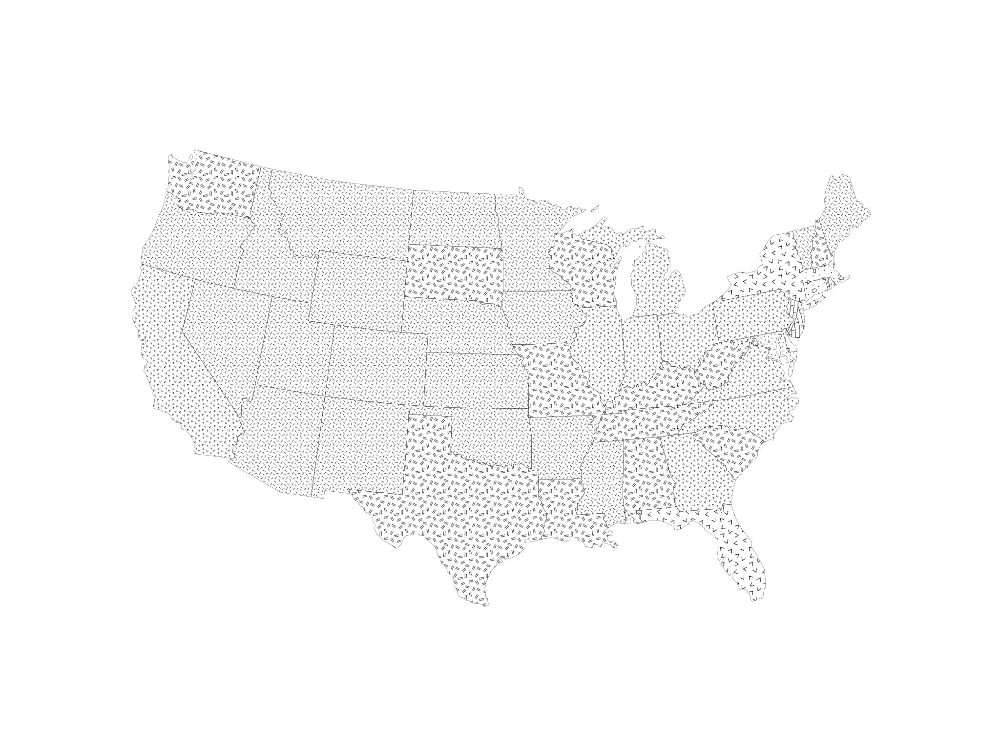

# MakiePatterns.jl

A Julia package for using raster pattern fills with Makie plotting, particularly useful for creating choropleth maps with pattern-based classifications instead of color gradients. The native Pattern type supports only `/`, `\`, `-`, `|`, `x`, and `+`.

## Features

- **471 Built-in Patterns**: Ships with a comprehensive collection of geologic/cartographic patterns used by the U.S. Geological Service
- **User patterns can be added from PNG files**
- **Auto-registration**: Patterns are automatically discovered and registered at module load time
- **Efficient Caching**: Loaded patterns are cached to avoid repeated file I/O
- **Flexible Scaling**: Control pattern size via downsample factors
- **Convenient API**: Simple functions for single or multi-pattern plots
- **Choropleth Support**: `patternpoly!` function for easy bin-based pattern mapping

## Installation

```julia
using Pkg
Pkg.add(url="https://github.com/technocrat/MakiePatterns.jl")
```

Or for development:

```julia
using Pkg
Pkg.develop(path="/path/to/MakiePatterns.jl")
```

## Quick Start

```julia
using MakiePatterns
using GeoMakie, CairoMakie

# See all available patterns
patterns = available_patterns()
# [:p101_C, :p101_DO, :p101_K, :p101_M, :p102_C, ...]

# Create a single pattern
pat = pattern(:p101_C)

# Use in a plot
f = Figure()
ax = Axis(f[1, 1])
poly!(ax, some_geometry; color=pat, strokewidth=0.5)
```

## Demo

Example of pattern-filled choropleth map using MakiePatterns:

```julia
using CairoMakie
using DataFrames
using Downloads
using GeoDataFrames
using GeoMakie
using MakiePatterns

url = "https://juliamapping.com/addn/geojson_example.json"
tmp = Downloads.download(url)
gdf = GeoDataFrames.read(tmp)  # auto-detects GeoJSON
gdf.bins = [2, 1, 1, 1, 3, 1, 6, 4, 8, 4, 3, 3, 1, 3, 3, 1, 1, 2, 2, 1, 5, 6, 3, 1, 1, 2, 1, 1, 1, 2, 7, 1, 4, 3, 1, 3, 1, 1, 3, 7, 2, 2, 2, 2, 1, 1, 3, 2, 2, 2, 1, 0]
gdf = subset(gdf, :name => ByRow(x -> x ∉ ["Alaska", "Hawaii", "Puerto Rico"]))

# Create figure
f = Figure(size=(3200, 2400))
ga = GeoAxis(f[1, 1]; dest="EPSG:5070")
hidedecorations!(ga)

# Use different downsample factors for different bins
# Smaller factors = larger patterns, larger factors = smaller patterns
patternpoly!(ga, gdf.geometry, gdf.bins;
             patterns=[:p313_K, :p315_K, :p317_K, :p319_K, :p601, :p605, :p632, :p634, :p636],
             factors=[6, 6, 6, 6, 4, 4, 4, 4, 4],
             strokewidth=0.5)

f
```



## Pattern Naming Convention

Patterns are automatically named based on their filename:
- Files starting with digits get a `p` prefix: `701.png` → `:p701`
- Files with descriptive names keep them: `hatch_dense.png` → `:hatch_dense`
- Hyphens and whitespace are converted to underscores: `101-C.png` → `:p101_C`

## Controlling Pattern Scale

The downsample factor controls how large patterns appear:
- **Larger factors** → **smaller patterns** (more repetitions)
- **Smaller factors** → **larger patterns** (fewer repetitions)

```julia
# Small pattern (more tiles)
pat_small = pattern(:p101_C; factor=10)

# Large pattern (fewer tiles)
pat_large = pattern(:p101_C; factor=2)

# Use default factor from patterns.toml
pat_default = pattern(:p101_C)
```

## Pattern Sources

Pattern assets are derived from the [Federal Geographic Data Committee Digital Cartographic Standard for Geologic Map Symbolization](https://ngmdb.usgs.gov/fgdc_gds/geolsymstd/download.php) by way of Daven Quinn's [github repo](https://github.com/davenquinn/geologic-patterns) under a Creative Commons CC0 License. A pattern chart can be found [here](https://ngmdb.usgs.gov/fgdc_gds/geolsymstd/fgdc-geolsym-patternchart.pdf).

## Contents

```@contents
Pages = ["api.md", "examples.md"]
Depth = 2
```
